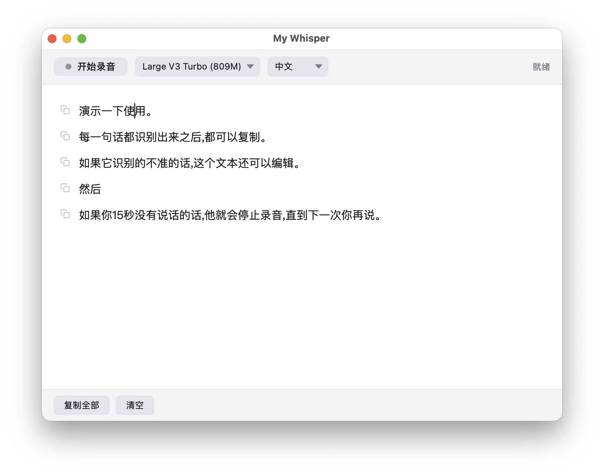
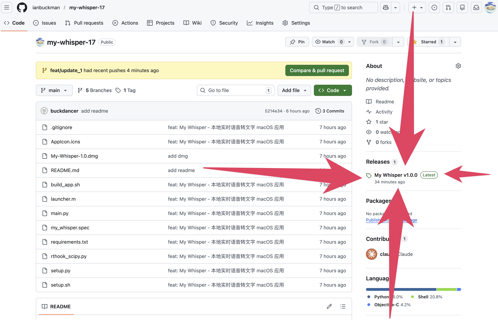

# My Whisper

macOS 本地实时语音转文字工具。基于 [MLX Whisper](https://github.com/ml-explore/mlx-examples/tree/main/whisper) 在 Apple Silicon 上高效运行，所有数据完全在本地处理，不上传任何内容。



## 下载安装

点击仓库右侧栏的 **Releases** 下载最新版本：



1. 前往 [Releases](../../releases) 页面，下载最新的 `My.Whisper.dmg`
2. 双击打开 DMG，将 **My Whisper** 拖入 Applications 文件夹

3. 双击打开 My Whisper 即可使用

> 应用已内嵌 whisper-large-v3-turbo 模型，无需联网下载，开箱即用。

## 系统要求

- macOS 14.0+
- Apple Silicon（M1 / M2 / M3 / M4）

## 使用方法

### 录音转写

按下全局快捷键（默认 `⌘⇧Space`）或点击窗口中的"开始录音"按钮开始录音，再次按下停止。App 会自动检测语音停顿并分段转写，结果实时显示在窗口中。15 秒无新转录会自动停止录音。

快捷键为系统级全局快捷键，无需聚焦窗口即可触发。点击工具栏中的快捷键按钮可自定义快捷键组合，设置会自动保存。

### 模型 & 语言切换

在窗口顶部的下拉菜单中可以切换模型和语言。内嵌的 Large V3 Turbo 开箱即用，切换到其他模型时会自动从 Hugging Face 下载。

支持语言：中文（默认）、English、日本語、한국어、自动检测。

### 复制 / 编辑

- 点击「复制全部」一键复制全部转写文本
- 点击任意文本段可直接编辑修正
- `⌘A` 全选、`⌘C` 复制

## 权限设置

首次使用需要在 **系统设置 → 隐私与安全性** 中授权：

| 权限 | 用途 |
|------|------|
| **麦克风** | 语音录制 |

## 快捷键

| 快捷键 | 功能 |
|--------|------|
| `⌘⇧Space`（默认，可自定义） | 开始 / 停止录音（全局） |
| `⌘Q` | 退出 |

## 构建

### 开发模式（推荐开发调试）

```bash
./setup.sh              # 首次：创建 venv + 安装依赖
source venv/bin/activate
python main.py
```

直接运行 Python 脚本，Dock 会显示 Python 图标（正常行为）。首次运行自动下载模型。

### py2app 构建（推荐分发）

```bash
venv/bin/python setup.py py2app
```

输出 `dist/My Whisper.app`。构建后需手动复制 mlx（namespace package，py2app 无法自动扫描）：

```bash
cp -r venv/lib/python3.14/site-packages/mlx \
      dist/My\ Whisper.app/Contents/Resources/lib/python3.14/mlx
```

此方式正确设置了 `LSUIElement`，App 仅在菜单栏显示图标，不出现在 Dock 中。

### build_app.sh（轻量构建）

```bash
./build_app.sh
```

编译 Objective-C launcher + 复制 venv 到 `.app` bundle，产物在项目根目录 `My Whisper.app`。构建速度快，适合本地快速测试。自动内嵌已下载的模型。

## 日志

运行日志位于 `~/Library/Logs/my-whisper.log`，遇到问题时可查看排查。

## License

MIT
